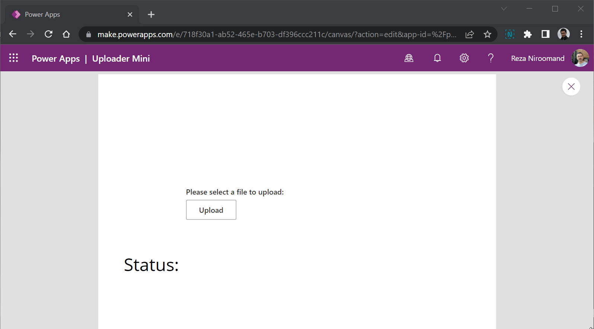

# Azure Uploader

Integrating Power Platform with Azure Storage Account doesn't have to be complex. Some times your users need to upload some files to be processed later. Imagine for example they need to send documents that a cloud flow (Power Automate) will then pick up and route to the relevant party to review or your AI in Copilot needs to extract information from them. In all these scenario you need a way that your users can send their files securely to an storage account which - unlike Dataverse - is not expensive.

Azure Storage Account support this scenario through short lived tokens that expire. You can generate **unlimited** number of these tokens. You can easily generate a token in a Canvas App using Azure Storage Account Connector or using a cloud flow in Power Automate. If only there was a PCF control that could then use that token and let the users upload their files you wouldn't need anything else.

Azure Uploader is the PCF control that can connect to Azure Storage Account and reliably and securely upload files directly from your Canvas App. You can also use it in a Model-Driven app, but you will need either a custom page or a dialog to host it.

To learn how to use Azure Uploader please read [my blog post](https://bycode.dev/2022/09/26/azure-uploader-for-power-platform-is-here/)
